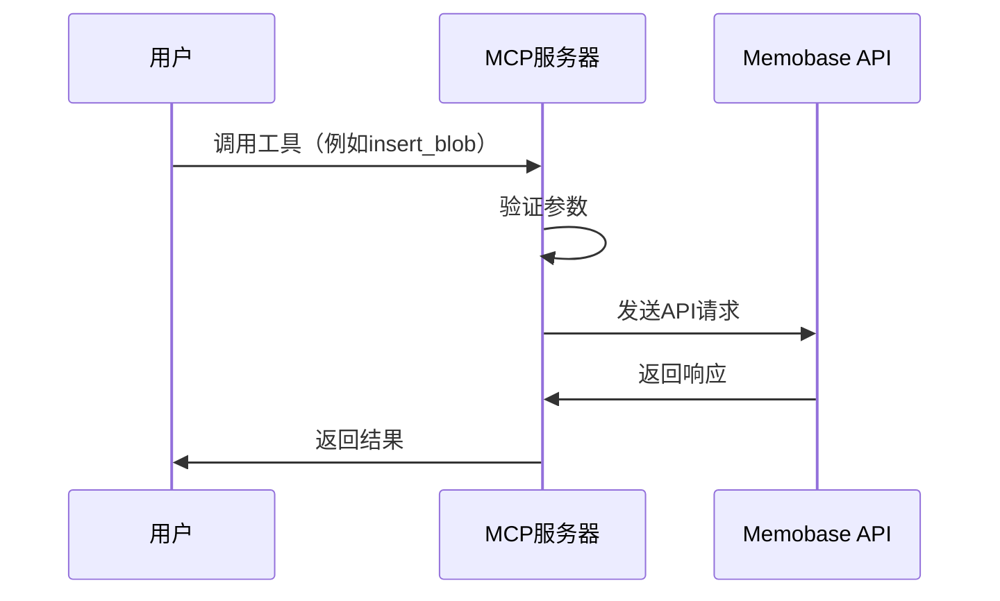

# MemoBase MCP服务器实现计划

## 项目概述

我们将创建一个名为"momedb-mcp"的MCP服务器，它将提供工具来管理AI应用的对话上下文。该服务器将专注于数据管理功能，包括插入、获取和删除对话数据。

## 项目结构

```
momedb-mcp/
├── package.json           # 项目配置文件
├── tsconfig.json          # TypeScript配置文件
├── src/
│   ├── index.ts           # 主入口文件
│   ├── config.ts          # 配置管理
│   ├── api/
│   │   ├── client.ts      # API客户端
│   │   └── types.ts       # API类型定义
│   └── tools/
│       ├── user.ts        # 用户管理工具
│       └── blob.ts        # 数据管理工具
└── docs/
    ├── README.md          # 项目文档
    ├── SETUP.md           # 安装和配置指南
    └── USAGE.md           # 使用指南
```

## MCP服务器实现

### 1. 配置管理

我们将创建一个配置管理模块，用于管理API密钥和其他配置选项。配置将通过环境变量提供，例如：

```typescript
// config.ts
export const API_KEY = process.env.MEMOBASE_API_KEY;
export const API_BASE_URL = process.env.MEMOBASE_API_URL || 'https://api.memobase.dev';
```

### 2. API客户端

我们将创建一个API客户端，用于与Memobase API进行通信。客户端将处理HTTP请求和响应，并提供错误处理机制。

```typescript
// api/client.ts
import axios from 'axios';
import { API_KEY, API_BASE_URL } from '../config';

const client = axios.create({
  baseURL: API_BASE_URL,
  headers: {
    'Authorization': `Bearer ${API_KEY}`,
    'Content-Type': 'application/json',
  },
});

export default client;
```

### 3. 工具和资源定义

我们将定义以下工具：

#### 用户管理工具

虽然用户管理不是重点，但我们仍将提供基本的用户管理功能：

- `create_user`: 创建新用户
- `get_user`: 获取用户信息
- `update_user`: 更新用户信息
- `delete_user`: 删除用户

#### 数据管理工具

这是我们的重点，我们将提供以下工具：

- `insert_blob`: 插入对话数据
- `get_blob`: 获取对话数据
- `delete_blob`: 删除对话数据

## 错误处理

我们将实现全面的错误处理机制，包括：

1. API错误处理：处理API请求失败、超时等情况
2. 参数验证：验证工具参数的有效性
3. 友好的错误消息：提供清晰、有用的错误消息

## MCP服务器流程图



## 工具使用示例

### 插入对话数据

```typescript
// 调用insert_blob工具
const result = await callTool('insert_blob', {
  uid: 'user123',
  blob_type: 'chat',
  blob_data: {
    messages: [
      { role: 'user', content: 'Hi, I'm here again' },
      { role: 'assistant', content: 'Hi, Gus! How can I help you?', alias: 'Character' }
    ]
  }
});
```

### 获取对话数据

```typescript
// 调用get_blob工具
const result = await callTool('get_blob', {
  uid: 'user123',
  bid: 'blob456'
});
```

### 删除对话数据

```typescript
// 调用delete_blob工具
const result = await callTool('delete_blob', {
  uid: 'user123',
  bid: 'blob456'
});
```

## 实现步骤

1. 创建项目目录结构
2. 初始化项目（package.json, tsconfig.json）
3. 实现配置管理模块
4. 实现API客户端
5. 实现用户管理工具
6. 实现数据管理工具
7. 编写文档